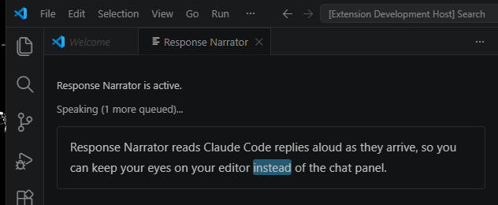

# Response Narrator

Response Narrator is a VS Code extension that reads new Claude Code assistant responses aloud via text-to-speech by watching its session transcript files.

If you find this useful, consider [sponsoring on GitHub](https://github.com/sponsors/TitanRIU).

## Features

- Watches your Claude Code session transcripts and reads new assistant responses aloud as they arrive, or only on demand, depending on Playback mode.
- Two voice engines: **System** (built-in OS voices — instant, works offline) and **Enhanced** (higher-quality neural voices via Microsoft Edge's online text-to-speech service), with automatic fallback to System if Enhanced is unavailable.
- Live word-by-word highlighting in the Response Narrator panel, synced to whichever engine is speaking.
- Play/Pause/Stop controls in the status bar, plus keyboard shortcuts (`Ctrl+Alt+P` to play/pause, `Ctrl+Alt+S` to stop).
- Auto or Manual playback modes, adjustable speed, and a voice picker for both engines.
- Responses are split into natural-sounding chunks — whole sentences where possible, falling back to a comma or other natural pause before ever cutting mid-word.
- Code blocks are announced (e.g. "TypeScript code block, 12 lines") instead of being read aloud character by character.

## Status

Actively developed and working. See [IDEAS.md](IDEAS.md) for what's being considered next.

## Feedback

Found a bug or have a feature request? [Open an issue](https://github.com/TitanRIU/Response-Narrator/issues) — or use the "Response Narrator: Report Issue / Give Feedback" entry in the extension's own menu, which opens the same page. For more open-ended ideas or questions, use [Discussions](https://github.com/TitanRIU/Response-Narrator/discussions) instead.
