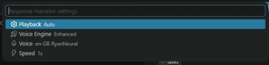

# Response Narrator

Response Narrator is a VS Code extension that reads new Claude Code assistant responses aloud via text-to-speech by watching its session transcript files.

If you find this useful, consider [sponsoring on GitHub](https://github.com/sponsors/TitanRIU).

## Getting Started

1. Install the extension. It activates automatically and starts watching your Claude Code session transcripts. No setup required.
2. By default it's in **Auto** mode: new Claude Code responses are read aloud as they arrive.
3. Look for the controls in the status bar (bottom right of the window): **Narrator** (opens the settings menu), a **Stop** button, and a **Play/Pause** button. Or use the keyboard shortcuts, `Ctrl+Alt+P` to play/pause and `Ctrl+Alt+S` to stop.
4. Click **Narrator** in the status bar to open the settings menu, where you can switch to **Manual** mode (only reads a response when you press play), change the **Voice Engine** (System or Enhanced), pick a **Voice**, or adjust **Speed**.
5. In Manual mode, press Play to hear the current or most recent response on demand.
6. The first time you use the **Enhanced** voice engine, you'll see a one-time prompt in the Response Narrator panel. Click **Enable** there to unlock audio playback (a one-time browser security requirement, not needed again after that).

## Features

- Watches your Claude Code session transcripts and reads new assistant responses aloud as they arrive, or only on demand, depending on Playback mode.
- Two voice engines: **System** (built-in OS voices: instant, works offline) and **Enhanced** (higher-quality neural voices via Microsoft Edge's online text-to-speech service), with automatic fallback to System if Enhanced is unavailable.
- Live word-by-word highlighting in the Response Narrator panel, synced to whichever engine is speaking.
- Play/Pause/Stop controls in the status bar, plus keyboard shortcuts (`Ctrl+Alt+P` to play/pause, `Ctrl+Alt+S` to stop).
- Auto or Manual playback modes, adjustable speed, and a voice picker for both engines.
- Responses are split into natural-sounding chunks: whole sentences where possible, falling back to a comma or other natural pause before ever cutting mid-word.
- Code blocks are announced (e.g. "TypeScript code block, 12 lines") instead of being read aloud character by character.

## Requirements

- The [Claude Code](https://marketplace.visualstudio.com/items?itemName=anthropic.claude-code) VS Code extension. Response Narrator reads its session transcripts, so it has nothing to narrate without it.
- It watches whichever Claude Code session was most recently active anywhere on your machine, not just the one open in the same VS Code window (useful if you run Claude Code across multiple workspaces at once).
- The Enhanced voice engine requires network access; the System voice engine works fully offline.

## Privacy

When using the **Enhanced** voice engine, the text of each response (with fenced code blocks replaced by a short spoken summary rather than sent as-is) is sent to Microsoft's Edge text-to-speech service to be synthesized into audio. This is an unofficial, undocumented API, not a formal Microsoft product. If you'd rather nothing leave your machine, use the **System** engine instead, which runs entirely offline through your OS's built-in voices.

## Status

Actively developed and working. See [IDEAS.md](IDEAS.md) for what's being considered next.

## Feedback

Found a bug or have a feature request? [Open an issue](https://github.com/TitanRIU/Response-Narrator/issues), or use the "Response Narrator: Report Issue / Give Feedback" entry in the extension's own menu, which opens the same page. For more open-ended ideas or questions, use [Discussions](https://github.com/TitanRIU/Response-Narrator/discussions) instead.
